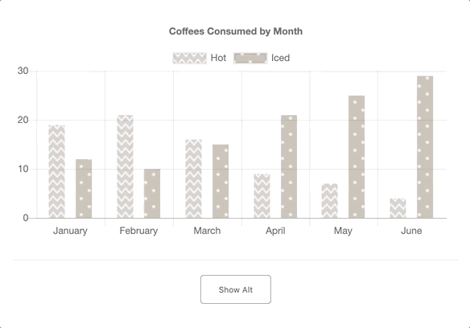

# chart-alt

```chart-alt``` makes it easy to add an alt format to your HTML5 chart created with Chart.js, such as an HTML table, that is screen reader accessible.

With one function call, ```chart-alt```
- generates an alt format (eg. HTML table with a descriptive caption) directly from your Chart.js instance
- inserts the alt format to the DOM (before the canvas chart)
- generates and adds fallback text to the canvas chart

---
[See live example](http://www.orianed.com/chartalt/eg)




---
## How to use

```chart-alt``` is not yet hosted on a cdn or npm. Until then, clone this repo, install dependencies, and use ```addChartAlt.js``` and ```styles_chartAlt.css``` from the src folder. 

Create your [Chart.js](https://www.chartjs.org/docs/latest/getting-started/usage.html) chart:

```javascript
// get 2d context of canvas for drawing chart
let ctx1 = document.getElementById('eg1').getContext('2d');

// instantiate a Chart.js chart with context and chart details
let chart1 = new Chart(ctx1, coffeeChart);
```

*With the canvas already in the DOM, pass your chart to ```addChartAlt()```. 

```javascript
addChartAlt(chart1);
```

### Toggle

By default, the alt format remains out of view and only accessible to screen readers. 

If you want to give users the option to see the alt format, set the ```toggle``` option to ```true```. ```chart-alt``` will generate and insert a button for toggling between the canvas chart and alt format.


```javascript
addChartAlt(chart1, true);
```

---

## Note

**Currently ```chart-alt``` only works for _bar charts_ created with Chart.js.** 
Support for more chart types coming soon! :)

*```addChartAlt()``` only works for canvas elements already in the DOM. If you create a new canvas element with Javascript for your chart, just be sure to first append it to the DOM before you add an alternative format using ```addChartAlt()```.